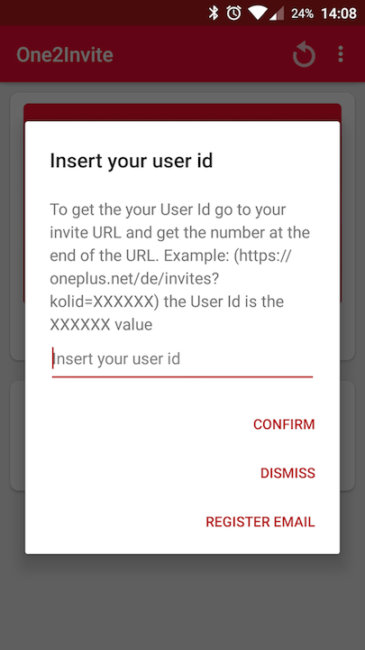
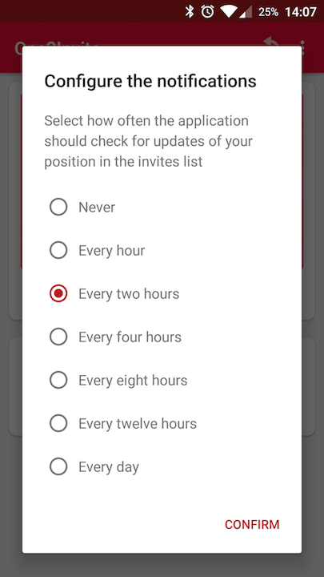
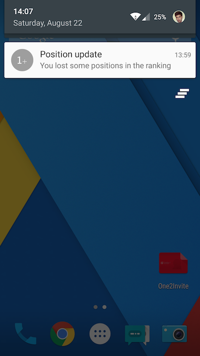

# One2Invite

With One2Invite you can add your User Id and track your position on the OnePlus 2 invite list. In the application you can see you current position in the invite list, the number of referrals you already have and share your invite url. The application also checks for position updates and produces a notification when your position changes.

## How to get the User id

To get your User Id just to to your referral URL and the last digits is your User Id.
https://oneplus.net/de/invites?*****=XXXXXX

The `XXXXXX` is the User Id.

If you find any bug or have any suggestions please contact me.

## Screenshots

## OnePlus Foruns thread

You can navigate in this [thread](https://forums.oneplus.net/threads/app-invite-tracker.335982/) to check the application story. 

## Contributing

If you want to suggest a new feature open an [issue](https://github.com/SandroMachado/one2invite/issues).

Please feel free to add new features submitting a [pull request](https://github.com/SandroMachado/one2invite/pulls). 